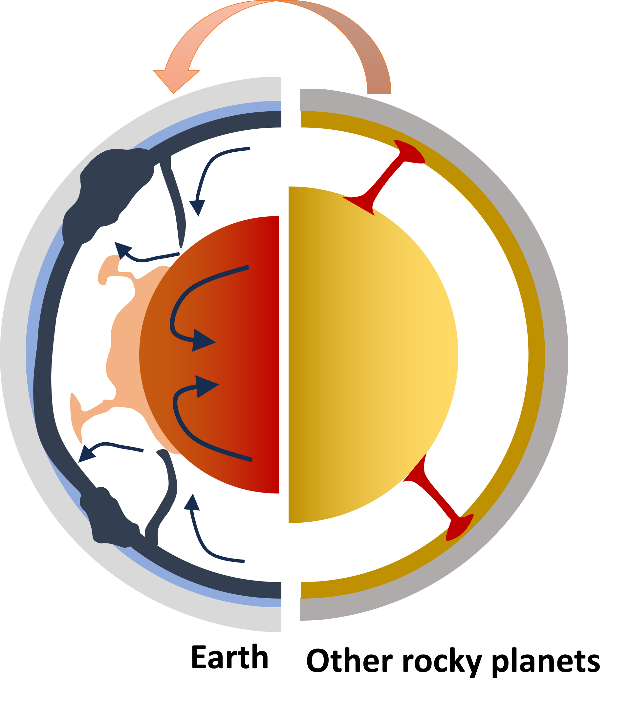

# Understanding Earth's Deep Interior

### An Online Workshop

## Description
Earth is the only rocky planet of the solar system that exhibits plate tectonics, which means the top part of the earth, known as lithosphere, is broken into pieces called plate. Plates can relatively move past each. But it has been a long time debate, what drives the plate motion. Using modern seismological network accorss the globe, we can now image the interior of earth. From these images we interpret the density structure of earth, that shows how the regions of downwelling and upwellings are distributed that could potentially pull and pushe the plates to move on surface. In this discussion, we will investigate how we can numerically calculate surface motion using density anomalies obtained from seismic measurements. Thus to integrate Earth's interior dynamics with the GPS measurement.

## Target audience

Undergraduate, postgraduate students, Any one interested

## Schedule

### Day 1: 

- Ray theory - Seismic wave propagation through homogeneous layered media - Travel time curve - Delay times 
- 1-D velocity inversion - Layer cake model
- Exercise 
- Assignment 

### Day 2: 

- Why numerical model?
- Governing equation of mantle convection
- Integrating mantle convection and plate tectonics 
- Mantle convection codes

!## Pages
!- [Participants](participants.md)
!- [Resources](resources.md)
!- [Feedback](feedback.md)

